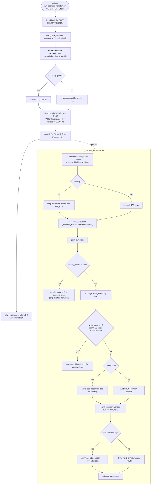
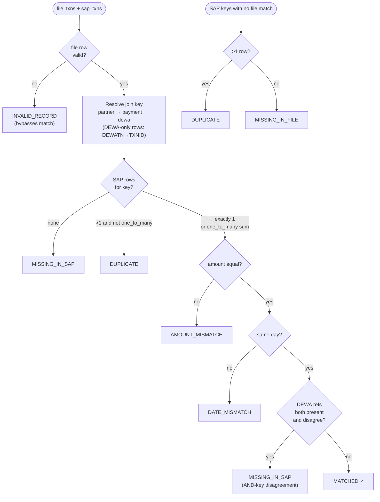
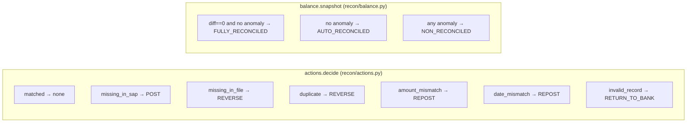
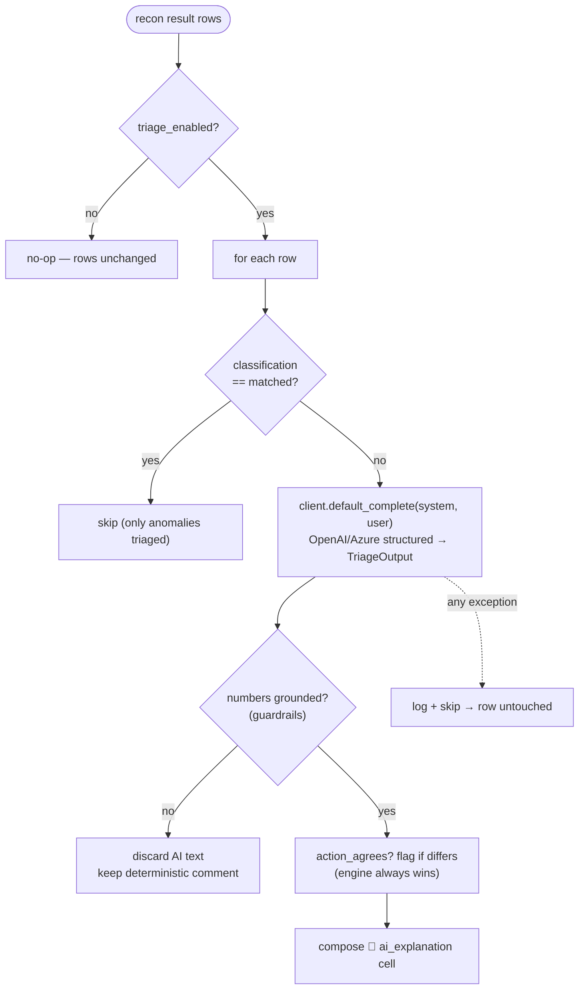
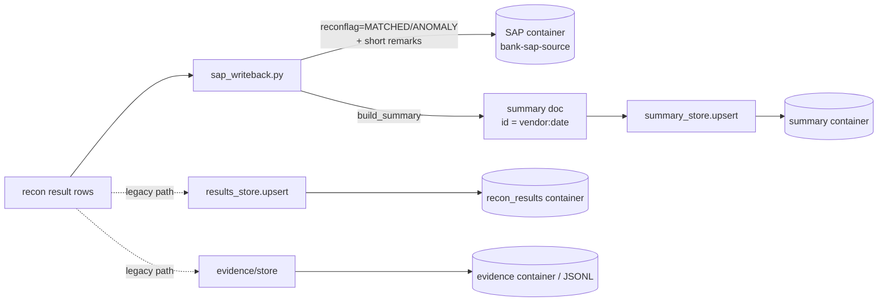
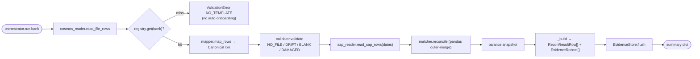

# Cosmos Reconciliation Workflow — Architecture & Logic Flow

End-to-end map of every module inside `cosmos_workflow/` and how data moves through them.
The pipeline is **deterministic money math** first; the AI layer is a strictly-additive,
fail-safe *advisory* on top. All writes are **opt-in** — the default run is read-only.

---

## 1. Layered module map

```mermaid
flowchart TB
    subgraph ENTRY["Entrypoints"]
        RUN["run_cosmos_workflow.py<br/><i>primary Cosmos runner (new canonical format)</i>"]
        MAIN["bank_reconciliation/main.py<br/><i>legacy / fixture orchestrator</i>"]
    end

    subgraph CFG["Config & Models"]
        CONFIG["config.py<br/>settings ← .env"]
        MODELS["models.py<br/>CanonicalTxn, ReconResultRow,<br/>BalanceSnapshot, Enums"]
    end

    subgraph SRC["Sources (I/O)"]
        COSREAD["sources/cosmos_reader.py<br/>read bank file rows"]
        SAPREAD["sources/sap_reader.py<br/>read SAP rows (cosmos|api)"]
    end

    subgraph SCH["Schema layer"]
        CMAP["schema/canonical_mapper.py<br/>NEW format → CanonicalTxn"]
        MAP["schema/mapper.py<br/>legacy FieldMapping → CanonicalTxn"]
        REG["schema/registry.py<br/>bank → FieldMapping"]
        VAL["schema/validator.py<br/>blank/drift/damaged checks"]
    end

    subgraph RECON["Recon engine (deterministic)"]
        DMATCH["recon/dynamic_matcher.py<br/>dynamic-key match"]
        MATCH["recon/matcher.py<br/>legacy pandas match"]
        BAL["recon/balance.py<br/>totals + recon_status"]
        ACT["recon/actions.py<br/>match_type → action+comment"]
        REP["recon/report.py<br/>reconcile_and_build, print, csv/xlsx"]
    end

    subgraph WRITE["Persistence (opt-in)"]
        SAPWB["recon/sap_writeback.py<br/>reconflag/remarks + summary doc"]
        SUMST["recon/summary_store.py<br/>upsert summary (per vendor+day)"]
        RESST["recon/results_store.py<br/>upsert per-row results"]
        EVID["evidence/store.py<br/>append-only audit trail"]
    end

    subgraph AI["Triage — advisory LLM (fail-safe)"]
        AGENT["triage/agent.py<br/>enrich_anomalies"]
        CLIENT["triage/client.py<br/>OpenAI/Azure adapter"]
        PROMPT["triage/prompt.py"]
        GUARD["triage/guardrails.py<br/>grounding + action check"]
        RSUM["triage/run_summary.py<br/>NL run summary"]
        TSCH["triage/schema.py<br/>TriageOutput"]
    end

    RUN --> CMAP & REP & SAPWB & SUMST & AGENT & RSUM
    MAIN --> ORCH["orchestrator.py"] --> COSREAD & SAPREAD & MAP & REG & VAL & MATCH & BAL & ACT & EVID
    CMAP & MAP --> MODELS
    REP --> DMATCH & BAL & ACT
    AGENT --> CLIENT & PROMPT & GUARD & TSCH
    RSUM --> CLIENT & GUARD
    ALL_MODULES(("all modules")) -.reads.-> CONFIG
```

> Two independent flows share the same models/config. **`run_cosmos_workflow.py`** is the
> current production path (new canonical contract). **`main.py → orchestrator.py`** is the
> older registry/fixture path kept for offline runs & tests.

---

## 2. Primary flow — `run_cosmos_workflow.py` (per-file processing)

The runner reads the email container once, **splits the rows into files by `Upload_Date`
(one bank sends one file per day)**, and processes each file independently — its own
reconciliation and its own summary doc.

**Key points:**
- **One file = one `Upload_Date`.** 3 files in the container → 3 reconciliations → 3 summary
  docs (`vendor:2026-07-01`, `vendor:2026-07-02`, `vendor:2026-07-03`).
- The **idempotency guard is per file** — an already-summarised day is skipped while the
  others still process.
- The summary doc is written **last** per file and is idempotent per `vendor:date`, so its
  existence signals that *that file* finished. The `>20% invalid` guard skips only the bad
  file, not the whole run.

---

## 3. Deterministic classification — `recon/dynamic_matcher.py`

The heart of the engine. Joins file ↔ SAP on a dynamic key and assigns exactly one
`match_type` per logical transaction, by strict precedence.

**Precedence:** `duplicate > amount > date > dewa-disagreement > matched`. Amounts and dates
compare at 2-decimal / day granularity; a missing date on either side is *not* a mismatch.

### match_type → action + balance status

---

## 4. AI triage — advisory, additive, fail-safe

The LLM never touches money. It only adds an `ai_explanation` column to *anomaly* rows and
phrases the run summary — and every failure path falls back to deterministic output.

- **`triage/prompt.py`** wraps untrusted free-text in `<field_data>` (prompt-injection guard)
  and tells the model the engine already decided the action.
- **`triage/guardrails.py`** rejects any money-shaped figure not present in the row, and
  flags (never overrides) action disagreements.
- **`triage/run_summary.py`** produces the `summary` field text — AI-phrased when grounded,
  otherwise a deterministic template (`_deterministic`). Currency is always **AED**.

---

## 5. Write targets (all opt-in)

| Writer | Container | Key / idempotency | Trigger |
|---|---|---|---|
| `_write_sap_reconflag` | `bank-sap-source` | matched on partner/payment/dewa id | `--write-sap` |
| `summary_store.upsert` | `summary` | `vendor_id:date`, preserves `created_at` | `--write-summary` |
| `results_store.upsert` | `recon_results` | `bank:settlement:partner_ref` | legacy orchestrator |
| `EvidenceStore.flush` | `evidence` / JSONL | `run_id:partner_txn_id`, append-only | legacy orchestrator |

---

## 6. Legacy / fixture flow — `orchestrator.py`

Kept for offline runs and tests (`source_mode=fixture`). Uses the **registry** (per-bank
`FieldMapping`) + `schema/mapper.py` + the pandas `recon/matcher.py`, and writes the
append-only evidence trail.

---

## 7. Configuration & modes (`config.py`)

Settings load from `cosmos_workflow/.env` (absolute path — cwd-independent). Credentials
never live in code.

| Setting | Effect |
|---|---|
| `SOURCE_MODE` | `cosmos` (live) vs `fixture` (local JSON, tests) |
| `COSMOS_*` | endpoint/key/database + file / SAP / registry / evidence / results / **summary** containers |
| `SAP_READ_MODE` | `cosmos` (read `bank-sap-source`) vs `api` (SAP team endpoint, later) |
| `TRIAGE_ENABLED` | master switch for the AI advisory layer (off ⇒ pure deterministic) |
| `LLM_PROVIDER` | `openai` \| `azure` — selects the client in `triage/client.py` |

**Design invariants:** deterministic engine is the source of truth; AI is additive and
fail-safe; writes are opt-in; the summary doc is written last and is idempotent per
vendor+day.
